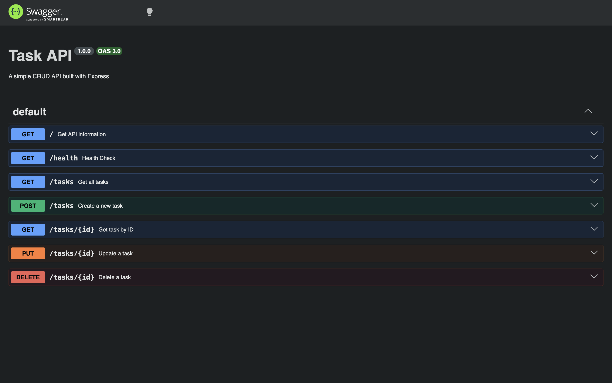

# Task API

A simple CRUD API built with Node.js and Express.

## Features

- Get all tasks
- Get task by ID
- Create a task
- Update a task
- Delete a task
- Swagger UI documentation

## Technologies

- Node.js
- Express.js
- Swagger UI

## Installation

```bash
git clone https://github.com/LUTHFI3518/task-api.git
cd task-api
npm install
node server.js
```

Server runs on:

```
http://localhost:3002
```

Swagger UI:

```
http://localhost:3002/docs
```

## API Endpoints

| Method | Endpoint | Description |
|---------|----------|-------------|
| GET | / | API information |
| GET | /health | Health check |
| GET | /tasks | Get all tasks |
| GET | /tasks/{id} | Get task by ID |
| POST | /tasks | Create task |
| PUT | /tasks/{id} | Update task |
| DELETE | /tasks/{id} | Delete task |

## Example Request

```bash
curl -i http://localhost:3002/tasks
```

## Status Codes

- 200 OK
- 201 Created
- 204 No Content
- 400 Bad Request
- 404 Not Found

## Swagger UI



## Author

Muhammed Luthufi TP
